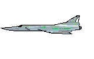

# Missile
Missile Clone in Godot 3.2

This is a classic style arcade game where you defend cities from a missile attack.

## Running the game

This game requires Godot 3.2.
You can download it here:
https://godotengine.org/download/windows

Once you have Godot installed you will be able to open the project in the src directory and 
run the game. The game has only been tested under Windows 10 but I expect it will work on 
macOS or Linux too.

TODO: Create an executable for Windows and put it in the dest folder.

### Controls
The plus-shaped cursor indicates the target location of a defensive missile. When you press the fire 
button, a missile will fly to that location and explode.

The cursor can be moved with the mouse or with the left stick on a controller.
You have three different bases. There is a separate fire button for each:

- Left base: Left mouse button, 'A' key on keyboard, or left button on controller
- Middle base: middle mouse button, 'S' key on keyboard, or bottom or top button on controller
- Right base: Right mouse button, 'D' key on keyboard, or right button on controller

Start the game by clicking the Start Button, pressing the '1' key on keyboard, 
or the start/options/plus button on controller

Reset the game by pressing the '9' key on keyboard, or the select/share/minus button on controller

## Gameplay
### Waves
Attacks come in waves. At the start of each wave, your missile bases are restocked. 
At the end of a wave you get bonus points.
Waves have a bonus multiplier that increases every other wave. The maximum multiplier is 6 X points.

### Bases

Each base has a limited number of defensive missiles. If a base it hit, it wipes out all missiles in that base until the next round.
The middle base has much faster missiles so it it best to save those for last if possible.

### Scoring
Score is kept for each enemy type and for bonus ammo and cities.
TODO: High Score that is kept between play sessions

### Cities

There are 6 cities that need to be defended. You get a bonus replacement city for each 10,000 points that you
score. 

### End of Game
When all cities are gone the game is over. 

TODO: Make a game over screen. Currently it just asks player to start a new game.

### Enemies
#### Missiles

ICBM Missiles come down from the top of the screen. They leave a smoke trail behind them. You have to target the missile 
at the bottom of the smoke trail.

ICBMs may "MIRV" and split into multiple missiles. This is dangerous it it happens at a low altitude.

TODO: 
- Don't destroy more than 3 cities per wave. This is related to the previous point, because each sub-wave only should attack
up to 3 cities. It isn't correct to just attach 3 cities for the entire wave, players would notice that and tend to
only defend 3 cities.

#### Bombers and Satellites

Bombers and satellites cross the screen and make fairly easy targets. They need to be taken out quickly or they may
drop additional missiles. 

#### Smart Missiles

Smart missiles appear in later rounds. These do not have a smoke trail. They have the ability to dodge defensive fire.
To defeat them you have to fire more accurately (nearer to them) or wedge them between two explosions.

#### UFO
TODO: Add a UFO that works like the one from Super Missile Attack which randomly fires an unblockable laser

## TODO
- Add sounds for bonus city, low ammo, out of ammo, smart missile
- Add game over screen
- Add UFO
- Continue playtesting wave timer
- Consider adding particle effects to the missiles or explosions
- Consider adding external json file that keeps high scores and allows user to customize difficulty etc
- Add option to let the user choose between classic mode and "super missile attack" which is more difficult
- Consider alternate graphics styles such as
  - 1st gen console
  - 8 bit computer
  - Arcade
  - Modern (Indy) graphics
- Improve sounds by creating them in audacity or finding good public domain ones

## Technical Notes
### How are the explosions drawn?
The explosions are circle-shaped sprites that are scaled using the Godot engine. 
See [The Explode Scene](src/Explode.tscn)

### How are the missiles and smoke trails drawn?
One of the key features of the arcade game is that the "smoke trails" are lines which are slowly drawn from the source
to the target. The "hard" part of this is to do the vector math that is able to move the line while also processing
the rest of the game.

Godot makes this easy in several ways.
The first way is that the work can be done in a separate scene, so that making multiple independent copies can be done
by instantiating the scene.

The second way is that Godot includes vector math helper methods that can easily figure out a velocity that points to
an end point, and you can just add that velocity in the _process loop until the endpoint is reached. (There are 
certainly other ways to do this by creating a path that an object can follow, but that would be overkill here). This
version of the game can be fancier than the arcade, which had simple dots for the missiles. Here, the missiles are 
rocket-shaped that are pointed to their destination using set_rotation_degrees() function that is available for
Godot sprites.

The third way is that Godot lets you mix drawing functions with spries by overriding the _draw() function. The 
smoke trail is done by this:

<pre>
func _draw():
	if cur_loc != null && phase == 0:
		draw_line(start_loc, cur_loc, defend_color)
</pre>

Note that draw() is normally only called once unless you call update() to trigger it, so update() is called in the 
function move_missile().

See [The ICBM Scene](src/ICBM.tscn) and [The Missile Scene](src/Missile.tscn). They have similar functionality.

### How does the smart missile dodge the explosions?
The smart missiles use multiple CollisionShape2D objects. One is the same size as the sprite and is used to detect that
the missile has been hit and should be destroyed. The other collision shapes surround the sprite and are used to
detect that the missile is near an explosion and should change it's trajectory. These proximity areas are handled by
events. For example, the DodgeAreaRight causes this function to run:

<pre>
func dodge_left(object):
	dodging = true
	start_loc = cur_loc
	dodge_end = start_loc + Vector2(-80, 0)
	start_dodge_timer()
</pre>

When the dodge timer expires, the missile recalculates the vector back to the original target.

This result is a weak attempt at dodging but it works pretty well in the game because the player has a lot of things
going on at once.

See [The Smart Bomb Scene](src/smart_bomb.tscn)

## Source Files

| File              | Description                                         |
| ----------------- | --------------------------------------------------- |
| Base.gd           | Missile base script (external script for Base.tscn) |
| Base.tscn         | Missile base scene                                  |
| Bomber.gd         | Bomber / Satellite script                           |
| Bomber.tscn       | Bomber scene                                        |
| Explode.tscn      | Explosion scene                                     |
| ICBM.tscn         | Enemy missiles                                      |
| Playfield.gd      | Script for the main game loop                       |
| Playfield.tscn    | Main scene                                          |
| ScoreOverlay.gd   | Script for the score and bonus text                 |
| ScoreOverlay.tscn | Scene to control scrore and other text              |
| smart_bomb.tscn   | Scene to control smart missiles                     |
| WaveInfo.gs       | Information for wave colors and difficulty          |

## Attributions
The game images were created using [Aseprite](https://www.aseprite.org/)

Most of the sounds were created using [Audacity](https://www.audacityteam.org/). 

The remaining sound files were found on soundbible.com which has various public licenses as noted.

#### Bomb Exploding
License: Attribution 3.0
Recorded by: Sound Explorer
Obtained from: http://soundbible.com/1986-Bomb-Exploding.html

#### Whoosh
License: Attribution 3.0
Recorded by Mark DiAngelo 
Obtained from: http://soundbible.com/2068-Woosh.html

#### Missile Launch
License: Public Domain
Recorded by Kibblesbob 
Obtained from: http://soundbible.com/1794-Missle-Launch.html
